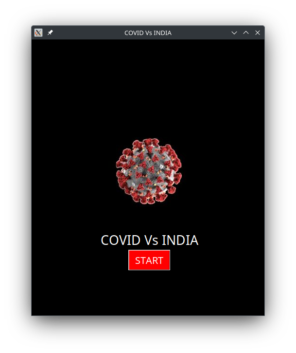

# COVID vs India Data Visualization

A Python-based data analysis project to visualize and analyze COVID-19 statistics in India.

## Overview

This project, originally developed as a 12th-grade final project during the peak of the pandemic, analyzes COVID-19 data in India, including confirmed cases, deaths, and recovery rates. It provides visual representations and insights about the pandemic's impact across different states and union territories of India. The timing of the project's development allowed for real-time analysis of one of the most significant health crises of our time.

## Features

- Analysis of confirmed COVID-19 cases
- Death rate visualization
- Recovery rate analysis
- State-wise comparison
- Time series analysis of COVID-19 spread

## Data Information
📅 The dataset used in this visualization covers COVID-19 statistics in India up to 2020. Please note that this historical data does not include updates beyond 2020.

## Dataset

The project uses the following datasets located in the assets folder:
- _covid_19_india.csv: Combined COVID-19 data
- _covid_19_india_confirmed.csv: Confirmed cases data
- _covid_19_india_deaths.csv: Death cases data
- _covid_19_india_cured.csv: Recovery cases data

## Requirements

- pandas
- numpy
- matplotlib
- pillow

## Installation

- Clone the repository:

`git clone https://github.com/yourusername/Covid_Vs_India.git
cd Covid_Vs_India`

- Install required packages:

`pip install -r requirements.txt`

## Usage

Run the main analysis script:

`python Covid_Vs_India.py`

## Visualizations

The project generates various visualizations including:
- Daily case trends
- State-wise distribution
- Recovery rate analysis
- Mortality rate analysis

## Screenshots

### Start Screen

### Selection

### Results

## Dataset Details
The visualization uses the following CSV files containing 2020 COVID-19 data for India:
- `_covid_19_india_confirmed.csv`: State-wise confirmed cases
- `_covid_19_india_deaths.csv`: State-wise death counts
- `_covid_19_india_cured.csv`: State-wise recovery data
- `_covid_19_india.csv`: Combined COVID-19 statistics

## Future Development

This project has several potential areas for expansion and improvement:

### Data Collection Enhancement
- Implement real-time web scraping to automatically fetch the latest medical data
- Add automated data validation and cleaning processes

### Technical Improvements
- Fix minor bugs in data processing and visualization
- Optimize code performance for larger datasets
- Enhance error handling and logging

### User Interface
- Develop a more intuitive and modern GUI
- Add interactive dashboard features
- Implement responsive design for better user experience
- Include customizable visualization options

### Scope Expansion
- Extend analysis to other prominent diseases and health conditions
- Add comparative analysis between different diseases
- Include vaccination data analysis
- Implement predictive modeling capabilities

### Documentation
- Add detailed API documentation
- Include more comprehensive usage examples
- Create video tutorials for setup and usage

If you're interested in contributing to any of these improvements, please check the Contributing section above.

## Contributing

- Fork the repository

`git clone https://github.com/yourusername/Covid_Vs_India.git`

- Create your feature branch 

`git checkout -b feature/AmazingFeature`

- Commit your changes 

`git commit -m 'Add some AmazingFeature'`

- Push to the branch 

`git push origin feature/AmazingFeature`
- Open a Pull Request

## License

This project is licensed under the MIT License - see the LICENSE file for details.

## Acknowledgments

- Data source: COVID-19 India Dataset
- Contributors and maintainers
- Open source community

## Contact

Rohit Bhandarkar

Project Link: https://github.com/yourusername/Covid_Vs_India